# NovelExtractor 桌面应用架构与界面设计

## 背景

当前项目是 Python CLI 工具，核心能力包括小说分章、章节窗口批次、模板路由、LLM 工具调用、Markdown 写入、SQLite 进度账本、运行日志、token 与费用统计。新版本要先做桌面应用，后续演进为 Web 应用，并为世界观设计、无限画布、人物关系图谱和卡片资产库预留高性能架构。

参考项目是 `E:\Github_Projects\DeepSeek-Reasonix`，主要借鉴它的事件流、配置驱动、长任务运行和桌面壳经验。多模型接入参考 [farion1231/cc-switch](https://github.com/farion1231/cc-switch) 的供应商预设、模型切换和 OpenAI-compatible 路由思路。界面布局参考 Meshy 工作区页面：顶部功能入口、右上用户入口、左侧窄功能栏、资产抽屉、资产类型列表、内容列表和右侧大预览区域。

## 参考截图

截图统一保存到 `docs/superpowers/reference/desktop-architecture/`。这些图只作为布局、信息层级、交互方式和视觉气质参考，最终界面需要结合本项目的书香气风格重绘。

### 资产页与功能入口

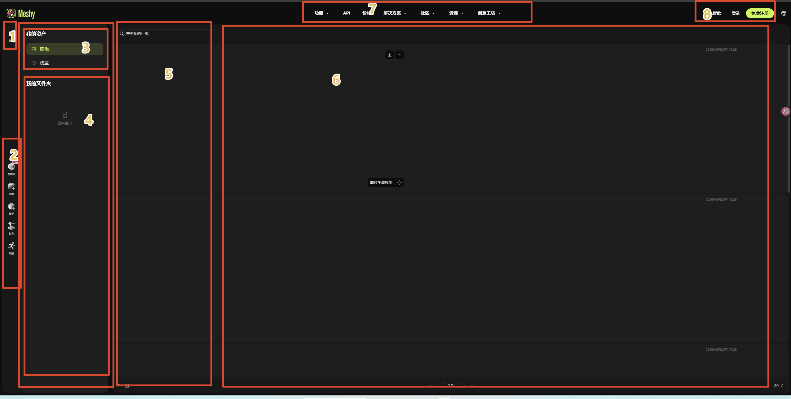

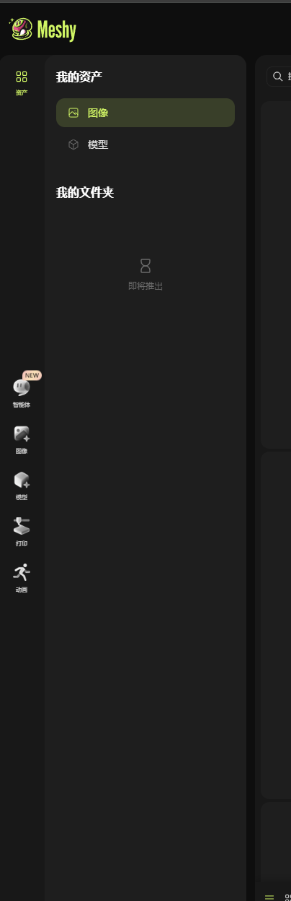

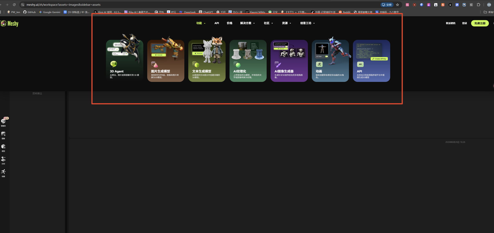

### 小说提取页

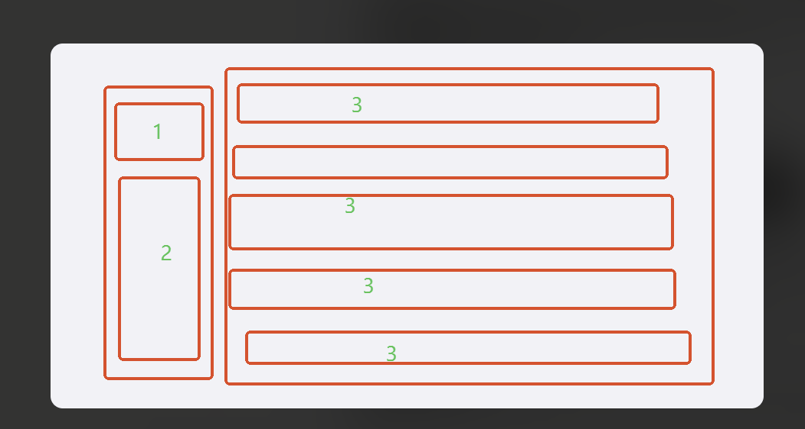

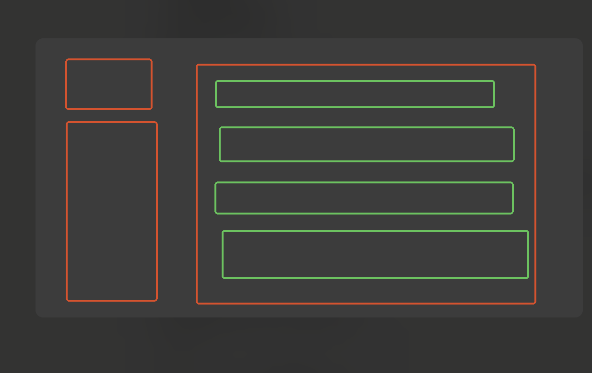

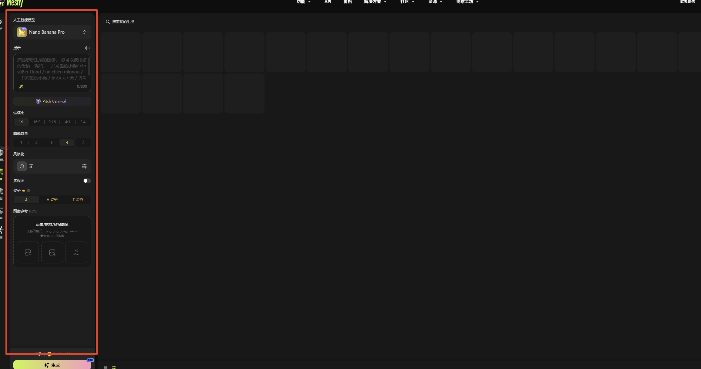

### 用户菜单

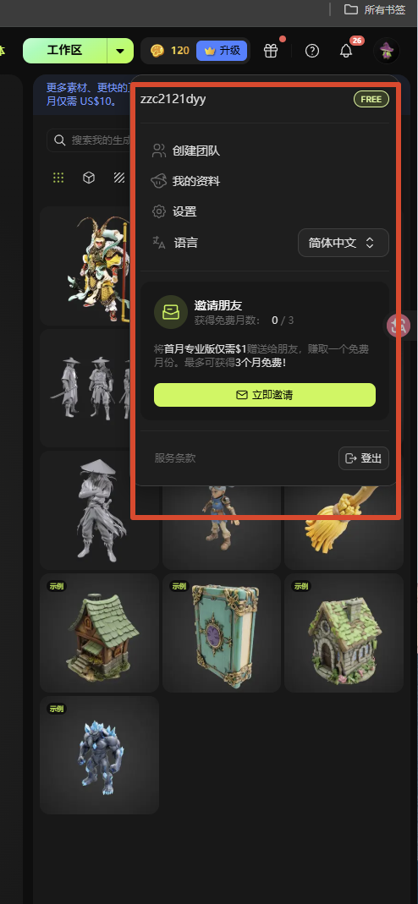

### 大模型配置弹窗

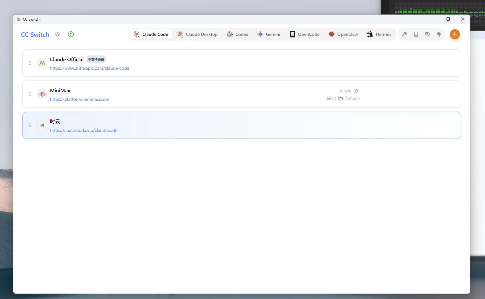

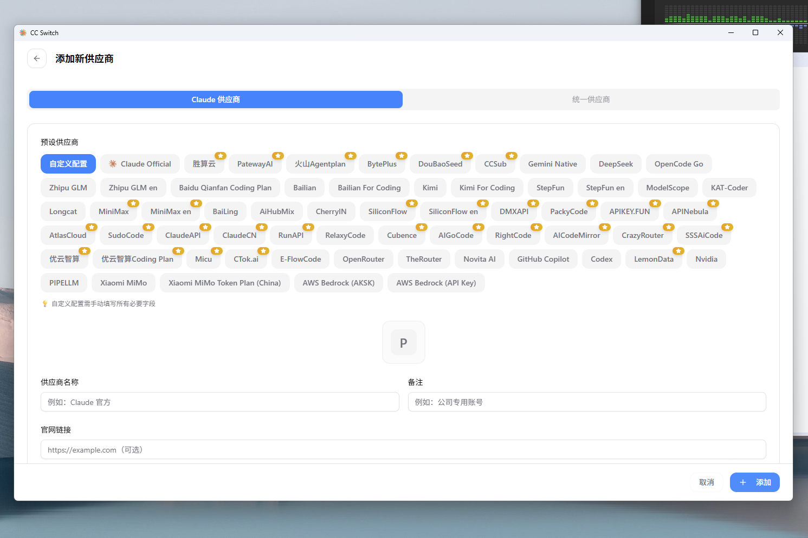

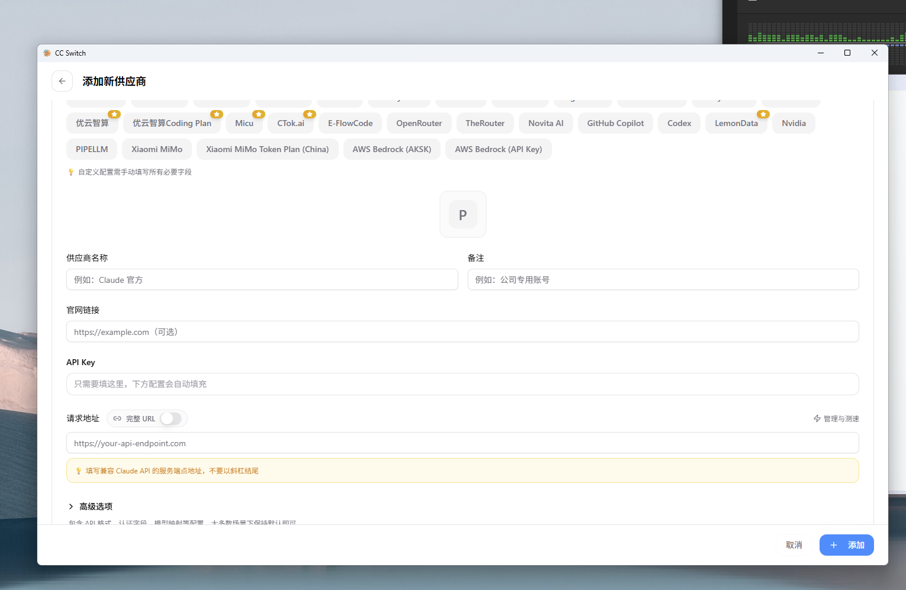

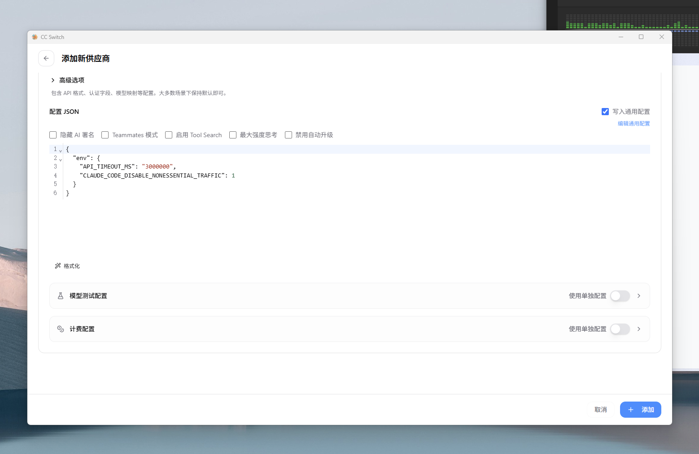

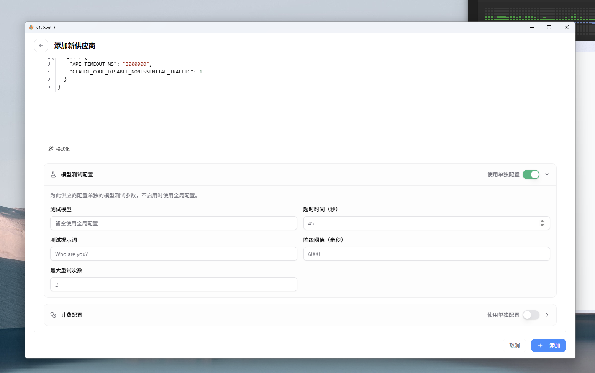

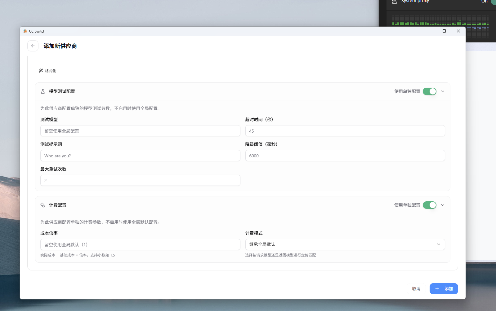

## 目标

第一版目标是把当前 CLI 能力产品化为桌面应用，不做完整世界观设计平台。

- 支持上传小说并复制进项目目录统一管理。
- 支持配置模板、章节批次、模型并创建提取任务。
- 支持在右上用户下拉中配置大模型供应商和模型列表。
- 支持任务开始、暂停、恢复、删除和展开查看详细日志。
- 提取输出仍是 Markdown 报告，作为第一阶段的阅读和归档产物。
- 资产页以书籍为第一类资产，支持查看提取后的 Markdown 报告。
- 关系图谱页只做入口占位，不实现图谱生成、卡片资产和无限画布。
- 架构预留未来从 Markdown 一次性导入世界观资产库的能力。
- 第一版采用 TypeScript 重新实现当前 Python CLI 的核心能力；旧 Python CLI、旧 YAML 配置和旧项目状态不需要兼容，后续可以删除。
- 第一版需要交付 Windows 可安装包，不能只停留在开发环境运行。

## 非目标

- 第一版不实现关系图谱生成。
- 第一版不实现人物卡、势力卡、地点卡、事件卡编辑。
- 第一版不实现无限画布。
- 第一版不实现 Markdown 与卡片资产的双向同步。
- 第一版不支持多任务并发运行。
- 第一版不实现真实登录、云同步和多语言切换，只保留用户身份和语言按钮占位。用户下拉中的大模型配置是本地功能，不依赖登录。
- 第一版不迁移旧 Python CLI 的命令、参数、YAML 配置和 SQLite 状态，也不提供旧项目导入能力。
- 第一版不把 token 预算、费用上限、缓存策略和日志保留策略暴露为用户可调设置。

## 目标模式执行范围

这份设计文档覆盖完整桌面化方向，但目标模式默认只把 P0 当作当前闭环。P0 完成后才继续 P1，不允许因为 P1/P2 功能未做完而阻塞 P0 交付。

P0 是最小可安装桌面闭环：

- Electron + React 桌面壳可启动、可打包 Windows 安装包。
- 首次启动可创建命名项目，项目数据写入应用定义的本地工作区。
- 工作区包含资产页、小说提取页和关系图谱占位页，关系图谱只显示明确的未开放状态。
- 大模型配置先支持 `DeepSeek` 和 `自定义 OpenAI-compatible` 两类供应商，支持 API key 引用、base URL、模型名和默认模型。
- 小说提取页支持上传 `.txt`、识别 UTF-8 / UTF-8 BOM / GBK / CP936、章节识别、模板选择、章节窗口参数和模型选择。
- 任务运行先支持同一时间一个任务，支持开始、窗口级暂停、继续、失败展示和删除任务记录。
- Markdown 报告写入书籍资产的 `reports/` 目录，并能在资产页只读预览。
- 日志至少记录任务状态、窗口进度、工具调用摘要、写入文件、错误摘要、token 和费用；密钥必须脱敏。

P1 是完整第一版增强：

- 补齐 MiniMax、GLM、Kimi、Xiaomi MiMo、Qwen 等供应商预设和模型能力 schema。
- 补齐供应商启用、删除、排序、连接测试、模型拉取、高级折叠配置和计费配置。
- 补齐任务等待队列、意外退出后的待继续恢复、失败后跳过当前窗口继续、共享报告删除保护。
- 补齐项目模板编辑、全局模板复制为项目模板、日志清理入口和 Markdown 预览安全细节。

P2 只作为架构预留：

- 世界观资产导入、人物/势力/地点/事件卡片、关系图谱生成、无限画布和高性能图谱渲染。

目标模式提示词：

```text
你现在进入目标模式，目标是按 `docs/superpowers/specs/2026-06-26-desktop-architecture-design.md` 推进 NovelExtractor 桌面应用。

默认沟通和文档使用中文。先把计划切成 P0/P1/P2：当前只执行 P0，P1/P2 不作为完成阻塞。P0 的完成定义是：Windows 可安装桌面应用可以创建项目、配置 DeepSeek 或自定义 OpenAI-compatible 模型、上传小说、识别章节、创建并运行单任务、写出 Markdown 报告、在资产页只读预览报告，并有关系图谱占位页。

执行前必须检查现有仓库结构、Git 状态和未提交改动；不要覆盖用户已有改动。代码实现保持简单、局部、可验证，但不能把配置数据、供应商、模型、模板、任务状态、菜单项和视觉 token 写死进业务逻辑。每一轮计划审查都要明确检查“通用架构、设计模式适配、配置化覆盖范围”。

前端设计必须使用 design-taste-frontend 做设计读法、视觉审查和交付前检查。把本项目读成：面向小说资料整理和长任务运行的桌面工作台，视觉语言是书香气、低饱和、现代工具化，密度高但不营销化。不要做落地页英雄区、不要做大面积营销卡片、不要照搬 AI 紫色渐变。重大 UI 完成前用浏览器截图或等价方式检查桌面和窄屏布局。

持续推进直到 P0 完成：先写可执行实施计划，再按测试优先的方式逐项实现。每个阶段都要运行对应验证命令；没有新鲜验证证据，不要声明完成。
```

## 技术路线

采用方案 1：Electron + TypeScript monorepo + React + WebGL/Canvas 预留。

推荐结构：

```text
apps/
  desktop/        Electron 桌面端
  web/            未来 Web 端占位

packages/
  ui/             React 组件、布局、主题、表单、图标
  domain/         小说、任务、模板、Markdown 报告、世界观资产等纯领域模型
  llm/            Provider registry、DeepSeek/OpenAI-compatible 适配器、usage 归一化
  tools/          Reasonix 风格工具接口、内置工具、工具注册表和写入保护
  extraction/     分章、窗口批次、模板路由、LLM 提取、Markdown 写入
  assets/         书籍资产、未来人物卡/势力卡/地点卡/关系边
  graph/          未来图谱模型、布局接口、WebGL 渲染适配
  persistence/    SQLite、文件系统、配置读写的接口与实现
  jobs/           后台任务、事件流、暂停、恢复、日志
  config/         配置 schema、默认值、模板规则、策略参数
```

`domain` 不依赖 Electron、React、SQLite 或文件系统。Electron、数据库、文件系统和 LLM API 都是外层适配器。当前 Python CLI 的核心业务能力需要重写到 TypeScript packages 中，不保留 Python 运行时作为桌面端依赖，也不保留旧 CLI 作为第一版交付要求。未来 WebUI 是优先演进方向，第一版需要避免业务逻辑绑定 Electron Main 或本地文件系统细节；迁移 Web 时通过替换本地存储、任务运行和文件访问适配器复用领域模型、任务模型、配置模型和前端组件。

## Reasonix 参考边界

工具系统、DeepSeek 接入、模型工具调用循环和运行日志优先参考 `E:\Github_Projects\DeepSeek-Reasonix`。用户提供的日志 `C:\Users\Administrator\Desktop\Global - E-AI_Projects-Cul….md` 作为小说提取工作流样例，用于校验工具调用顺序、输出命名和日志展示。

需要优先继承的 Reasonix 工程原则：

- Provider 使用 registry：`kind = "openai"` 表示 OpenAI-compatible 协议，DeepSeek 是配置实例，不是硬编码 provider。
- 一个 provider 可暴露多个模型：`models`、`default`、`api_key_env`、`base_url` 组合定义模型来源。
- DeepSeek 接入默认走 `https://api.deepseek.com` 和 `/chat/completions`，密钥通过环境变量或安全凭据引用，不写入项目文件。
- 工具使用 registry：运行时按配置组装启用工具，模型只看到本次任务允许的工具 schema。
- 工具参数使用 JSON Schema，工具调用参数以 raw JSON 进入工具实现，工具自己负责校验和错误返回。
- 工具错误返回给模型作为可恢复上下文，不直接让整个任务崩溃，除非属于认证、预算、写入边界等不可恢复错误。
- 读工具和写工具区分 side effect。读工具可以并行，写工具保持顺序，避免读写交错破坏去重和补充逻辑。
- 写入工具应支持预览或可审计摘要，方便 UI 展示将写入的 Markdown 文件和变更范围。
- 工具运行必须绑定项目资产目录和输出目录为可写根，避免出现模型绕过 writer tool 改用 shell 写文件。

第一版内置工具优先参考 Reasonix 的工具语义，但只启用小说提取需要的最小集合：

- `ls`：列出项目内目录。
- `read_file`：读取小说分块、模板和已有 Markdown 报告。
- `grep`：在已有报告中查找重复条目或相关内容。
- `write_file`：创建 Markdown 报告。
- `edit_file` / `multi_edit`：补充或修正 Markdown 报告。
- `todo_write` / `complete_step`：仅作为内部任务日志和步骤验收语义参考，第一版不作为模型可调用工具暴露。

不把 `bash` 作为小说提取写文件的默认工具。shell 类工具如后续引入，应默认禁用写入能力，并放在单独的高风险工具策略下。

日志样例体现的提取策略需要进入任务 prompt 和工具约束：

- 逐章或按窗口读取，不一次性塞入全书。
- 按模板抽取，输出文件名由模板名去掉 `模板` 得到。
- 写入前查询已有 Markdown，重复内容完善则补充，不完善则跳过或更新。
- 每个任务记录工具调用、参数摘要、错误、写入文件和验证结果。

## 数据流

第一阶段 Markdown 报告线：

```text
上传小说
  -> 复制到项目资产目录
  -> 分章识别
  -> 创建提取任务
  -> 按章节窗口和模板运行 LLM 提取
  -> 写入 Markdown 报告
  -> 记录任务状态、日志、token、费用
```

第二阶段世界观资产线作为后续能力：

```text
Markdown 报告
  -> 一次性导入任务
  -> 候选人物/势力/地点/事件/关系
  -> 用户确认导入
  -> 独立世界观资产库
  -> 图谱、卡片、无限画布、创作素材
```

一次性导入后，卡片和图谱资产独立于 Markdown。Markdown 重新生成不会自动覆盖已生成资产。

## 持久化设计

每个项目有独立项目目录和本地数据库。第一版不让用户选择项目目录，只让用户输入项目名称；应用在自己定义的全局工作区根目录下创建项目目录。Windows 默认工作区根目录使用系统应用数据目录下的 NovelExtractor 专属目录，具体路径由配置层统一定义，业务代码只接收 `projectRoot`。

项目创建规则：

- 用户创建项目时只填写项目名称。
- 数据库生成项目 ID，目录名使用安全化后的项目 ID 或项目 slug，避免项目名中的特殊字符影响文件系统。
- 同名项目需要提示用户已存在，不直接覆盖。
- 第一版不导入旧 YAML 配置、旧 SQLite 状态和旧 Markdown 输出目录。
- 最近项目列表从全局配置读取，但项目真实数据仍保存在各自项目目录。

```text
<projectRoot>/
  .novel-studio/
    project.sqlite
    logs/
    presets/
  assets/
    books/
      <bookId>/
        source/
          original.txt
        reports/
          丹药分析.md
          材料分析.md
          NPC性格与代表事件.md
        templates/
          项目自定义模板.md
```

项目数据库保存：

- 项目元数据：项目 ID、项目名称、创建时间、最近打开时间。
- 书籍资产元数据。
- 上传文件记录和章节识别结果。
- 提取任务、运行状态、窗口进度和模板快照。
- token 用量、费用、缓存统计。
- 日志索引和错误记录。
- 未来的卡片、关系边、画布布局和图谱视图数据。

全局配置保存：

- 模型供应商和模型列表。
- API key 引用，密钥使用系统 keychain 或加密本地凭据保存；API key 不进入项目目录、日志和导出文件。
- 全局内置模板库。
- 最近项目、主题、界面偏好。

模型配置采用 Reasonix provider 结构的 TypeScript 版本：

```text
ProviderConfig
  name
  kind                 # 第一版主要是 openai-compatible
  baseUrl
  models
  defaultModel
  apiKeyRef            # 指向安全凭据，不保存明文
  contextWindow
  pricing              # 内部统计用，不在第一版 UI 暴露为高级设置
  effort               # DeepSeek 可使用 high/max，第一版使用默认值
```

模型引用支持 provider 名称、模型名或 `provider/model`，但 UI 第一版只展示“设置中已配置的可选模型”。

模型供应商采用三层配置：

```text
ProviderPreset
  id
  displayName
  kind
  baseUrl
  authScheme
  defaultModels
  modelCapabilities

UserProviderConfig
  presetId
  enabled
  apiKeyRef
  baseUrlOverride       # 仅自定义供应商或高级编辑可用
  models
  defaultModel

ModelOption
  id
  displayName
  providerId
  contextWindow
  supportsTools
  supportsReasoning
  usageMapping
```

P0 内置供应商预设只要求 `自定义` 和 `DeepSeek`。P1 完整第一版补齐：`MiniMax`、`GLM`、`Kimi`、`Xiaomi MiMo`、`Qwen（通义千问）`。每个供应商都通过配置暴露多个模型。模型 ID 必须是真实可用模型，不使用占位模型名；具体模型列表从 provider preset schema 读取，不写死在提取业务里。provider preset 采用简单本地 schema 文件维护，参考 CC Switch 的预设结构；供应商模型变化时由维护者手动替换 preset 文件，不实现远程自动更新。

`自定义` 供应商用于 OpenAI-compatible 接入，用户可以填写名称、base URL、API key 引用、模型列表和默认模型。官方供应商默认隐藏 base URL，只允许在高级编辑中覆盖，避免普通用户误改接入地址。支持 OpenAI-compatible `/v1/models` 的供应商可以提供 `拉取模型` 操作；不支持时回退到手动新增模型。

任务运行时使用“当前最新模型配置”。如果任务创建后用户修改 provider、API key、默认模型或模型列表，继续运行时自动使用新配置；若新配置导致认证失败、模型不存在、能力不匹配或连接失败，任务进入暂停状态并记录暂停原因，UI 明确提示用户需要修复模型配置后再继续。

日志与隐私规则：

- 日志默认记录事件类型、时间、任务 ID、窗口 ID、模板组 ID、工具名、参数摘要、写入文件路径、错误摘要和用量统计。
- API key、Authorization header、完整凭据路径和其他密钥字段必须脱敏。
- Prompt、小说原文片段、模型响应全文属于敏感内容；第一版如需落盘用于排障，必须放在项目日志目录内，并在 UI 中提供清理日志入口。
- 连接测试日志只保存测试结果、供应商、模型 ID 和错误摘要，不保存请求正文和密钥。
- 删除任务默认删除任务记录、状态和日志索引；是否删除日志文件按任务日志归属执行，不能影响其他任务日志。

## 配置化范围

以下内容必须走配置或 schema，不写死在业务代码里：

- 模板列表、模板字段、模板说明、输出文档名规则。
- 资产类型列表，第一版只启用 `书籍`。
- 未来节点类型、关系类型、颜色、图标和默认字段。
- 单次章节数默认值。
- 章节重叠策略默认值。
- 提取章节数默认策略。
- 模型供应商预设、模型选项、默认模型、能力标记和 usage 映射。
- 右上用户下拉菜单项。
- 主题 token、动效 token 和阅读区视觉参数。
- 任务状态和可执行操作映射。

章节标题识别使用内置通用规则，参考现有 CLI 的章节识别能力覆盖中文数字、阿拉伯数字和常见章节标题格式。第一版不向用户提供章节识别规则设置。

`timeout` 是模型请求超时时间，`temperature` 是模型输出随机性。第一版不向用户提供这两个设置，统一由模型适配器使用内部默认值。

token 预算、缓存策略和日志保留策略属于内部运行策略，第一版不向用户提供设置入口。实现层可保留默认值，以便后续排障或版本升级调整。

第一版 UI 不提供高级参数面板。用户可见的基础参数只有模板选择、单次章节数、提取章节数、模型选择、创建任务、保存为预设。

## 运行时架构

运行区隔：

```text
Electron Main
  窗口、菜单、文件系统权限、系统对话框、IPC 路由

Renderer
  React UI、资产页、小说提取页、Markdown 预览、图谱占位页

Worker Pool
  分章解析、Markdown 读取、搜索索引、未来图谱过滤和布局预计算

Job Runtime
  LLM 提取任务、工具调用、Markdown 写入、日志、暂停、恢复
```

Job Runtime 通过统一事件流驱动 UI：

```text
job.created
job.started
job.window.started
job.window.completed
job.group.routed
job.model.call
job.tool.call
job.file.written
job.usage.updated
job.pause.requested
job.paused
job.resume.requested
job.failed
job.skipped
job.completed
```

暂停采用窗口级安全暂停：用户点击暂停后，当前窗口完成后再进入暂停状态。LLM 请求已经发出时不承诺立即中断，模板组运行中也不在中间强制停止。系统主动暂停也必须记录原因，例如模型配置失败、认证失败、写入边界违规、编码/章节拆分需要用户处理等。

P0 只要求创建并运行一个任务；如果已有任务运行中，创建或启动新任务可以先被禁用并给出提示。P1 完整第一版允许创建多个任务，但同一时间只运行一个任务；用户启动多个任务时，后启动的任务进入等待队列，等待上一个任务完成、暂停或失败后再运行。

任务状态机分层：P0 只实现 `待开始`、`运行中`、`将在当前窗口后暂停`、`已暂停`、`失败`、`完成` 和 `已删除`；`等待中`、`待继续`、失败后跳过当前窗口继续和崩溃恢复属于 P1。完整第一版状态机如下：

```text
待开始
  start -> 等待中 / 运行中

等待中
  previous.finished -> 运行中
  delete -> 已删除

运行中
  pause.requested -> 将在当前窗口后暂停
  current.window.failed -> 失败
  system.pause -> 已暂停
  all.windows.completed -> 完成

将在当前窗口后暂停
  current.window.completed -> 已暂停
  current.window.failed -> 失败

已暂停
  continue -> 等待中 / 运行中
  delete -> 已删除

待继续
  continue -> 等待中 / 运行中
  delete -> 已删除

失败
  continue -> 弹窗确认
  delete -> 已删除

弹窗确认
  skip.current.window -> 标记当前失败窗口为跳过，进入等待中 / 运行中
  cancel -> 失败

完成
  delete -> 已删除
```

失败后的继续行为必须弹窗确认。弹窗展示失败原因、失败窗口或章节批次、相关模板组、错误摘要和可能影响；用户确认后可以跳过当前失败窗口继续后续窗口。用户取消则任务保持失败状态。

应用退出、崩溃、系统睡眠或进程意外中断后，重启时将原 `运行中`、`等待中` 和 `将在当前窗口后暂停` 的任务恢复为 `待继续` 视图状态。用户需要手动点击继续，系统不得自动重放可能已经部分写入的窗口。

写入路径安全边界：

- 模型工具只能读写当前项目允许的资产目录和输出目录。
- 工具收到路径后必须规范化为绝对路径，并确认最终路径仍位于允许根目录内。
- 拒绝 `..` 路径逃逸、绝对路径、UNC 路径、符号链接逃逸和大小写绕过。
- 拒绝模型直接指定项目外文件，即使文件名看起来像 Markdown 报告。
- 写工具只接受业务层允许的输出文件名，不接受任意目标路径。

Markdown 预览安全边界：

- 第一版只支持 Markdown 基础格式预览，例如标题、段落、列表、引用、代码块、表格和分隔线。
- 默认禁用原始 HTML、脚本、iframe、内联事件、远程图片自动加载和本地文件链接自动加载。
- 链接点击必须走外部浏览器或受控确认流程，不在 Electron Renderer 内直接执行不可信内容。

## 页面布局

整体采用 Meshy 式工作区结构，但内容服务于小说提取和世界观资产。

顶部：

- 左侧显示产品 Logo。
- 中间只有 `功能` 下拉，鼠标悬浮后展开功能列表。
- 功能列表第一版包含 `小说提取` 和 `关系图谱`，不包含资产入口。
- 右侧显示用户和语言按钮占位。用户头像点击后展开角色菜单，语言切换只做按钮占位。

左侧窄栏：

- 顶部是资产入口按钮。
- 中部是功能快捷按钮，包含 `小说提取` 和 `关系图谱`。
- 资产入口和功能入口保持分离。

### 用户下拉与模型配置

用户下拉参考 Meshy 的角色菜单结构，但第一版只做本地身份入口，不接入真实账号系统。

```text
用户下拉
├─ 本地用户名 / 当前项目身份
├─ 我的资料        占位
├─ 大模型配置
├─ 设置            占位
├─ 语言            占位
└─ 退出            占位
```

`大模型配置` 只使用弹窗，不使用右侧抽屉。弹窗参考 CC Switch 的供应商管理界面：大尺寸居中浮层、顶部标题区、内容区可滚动、底部固定操作栏。

```text
模型配置中心弹窗
├─ 顶部
│  ├─ 标题：大模型配置
│  ├─ 供应商分类标签：全部 / 已启用 / 未配置
│  └─ 添加按钮
├─ 已配置供应商列表
│  ├─ 供应商卡片
│  │  ├─ 拖拽排序手柄
│  │  ├─ 图标、名称、官网链接
│  │  ├─ 默认模型和模型数量
│  │  ├─ API Key 状态
│  │  ├─ 启用状态
│  │  └─ 编辑、连接测试、删除
│  └─ 选中卡片使用柔和描边和浅色底
└─ 底部
   └─ 关闭
```

点击 `添加` 或 `编辑` 打开第二层弹窗：

```text
添加/编辑供应商弹窗
├─ 顶部
│  ├─ 返回按钮
│  └─ 标题：添加新供应商 / 编辑供应商
├─ 供应商模式
│  ├─ 官方预设
│  └─ 自定义配置
├─ 预设供应商胶囊列表
│  ├─ 自定义配置
│  ├─ MiniMax
│  ├─ DeepSeek
│  ├─ GLM
│  ├─ Kimi
│  ├─ Xiaomi MiMo / 小米 MiMo
│  └─ Qwen / 通义千问
├─ 基础字段
│  ├─ 供应商名称
│  ├─ 备注
│  ├─ 官网链接
│  ├─ API Key
│  └─ 请求地址 / 完整 URL 模式
├─ 模型配置
│  ├─ 拉取模型
│  ├─ 模型映射表
│  └─ 默认模型
├─ 高级选项
│  ├─ 协议格式
│  ├─ 认证字段
│  ├─ 推理参数适配
│  ├─ 模型测试配置
│  └─ 计费配置
└─ 底部固定操作
   ├─ 取消
   └─ 添加 / 保存
```

预设供应商使用 CC Switch 式胶囊按钮排列。P0 只显示 `自定义配置` 和 `DeepSeek`；P1 再显示完整第一版允许的供应商，不展示 cc-switch 里其他第三方代理服务。选择官方预设后自动填充供应商名称、官网链接、默认请求地址、模型预设和能力标记；选择 `自定义配置` 时需要用户手动填写必要字段。

模型列表以可编辑表格或紧凑卡片展示，字段包括模型显示名、模型 ID、上下文窗口、是否支持工具调用、是否支持推理参数和是否默认。官方供应商提供预置模型，用户可拉取、新增、禁用或改默认模型；自定义供应商允许新增多个模型和 base URL。

API key 不进入项目目录和导出文件。UI 只显示 `已配置`、`未配置` 或 `来自环境变量`。连接测试只验证认证、模型名和一次最小请求，不暴露 `timeout`、`temperature`、token 预算、缓存策略或日志保留策略给用户。

高级选项默认折叠，参考 CC Switch 的处理方式。P0 可以展示折叠入口，但只需保存 DeepSeek 和自定义 OpenAI-compatible 所需的必要配置。P1 再补齐协议格式、完整 URL 模式、模型测试配置和计费配置；普通用户不需要展开高级选项也能完成 DeepSeek、MiniMax、GLM、Kimi、Xiaomi MiMo 和 Qwen 的配置。

小说提取页的模型选择只读取已启用且通过基础校验的模型。如果没有任何可用模型，显示 `前往大模型配置` 按钮，打开同一个用户下拉配置入口。

### 资产页

资产页用于只读浏览，不显示提取进度或运行日志。

```text
左侧窄栏
  资产入口 / 小说提取 / 关系图谱

资产抽屉
  我的资产
    书籍
  我的文件夹
    第一版显示空状态

文档列表
  搜索
  丹药分析
  材料分析
  NPC性格与代表事件
  势力设定
  事件因果链

主区域
  Markdown 只读预览
```

资产类型第一版只有 `书籍`。选择书籍后，文档列表加载该书籍 `reports/` 目录下的 Markdown 报告。

报告命名规则：

- `丹药分析模板.md` 输出为 `丹药分析.md`。
- `材料分析模板.md` 输出为 `材料分析.md`。
- 规则为模板名去掉 `模板` 两字，扩展名保持 Markdown。
- 如果模板名不包含 `模板` 两字，则直接使用模板名作为输出文档名。
- 如果用户在模板配置中显式填写 `输出文档名`，优先使用显式输出文档名。

Markdown 预览区域第一版只支持基础 Markdown 阅读和滚动。目录、全文搜索、高亮定位可作为后续增强。

### 小说提取页

小说提取页参考 Meshy 参数侧栏布局，左侧创建任务，右侧显示任务列表。

```text
小说提取页
├─ 左侧参数栏
│  ├─ 上传小说
│  └─ 基础参数
└─ 右侧任务区
   └─ 拆解任务列表
```

上传小说：

- 支持拖拽和点击选择 `.txt` 文件。
- 读取 `.txt` 时自动识别编码，至少覆盖 UTF-8、UTF-8 BOM、GBK/CP936 和常见中文文本换行。
- 编码识别失败时提示用户选择编码或重新上传，不创建书籍资产。
- 上传后复制到项目目录统一管理。
- 显示文件名、大小、识别章节数、章节标题识别状态。
- 上传成功后生成或更新书籍资产；书籍资产使用数据库 ID，源文件名只作为显示字段。
- 如果同名书籍已经存在，提示用户这本书已经提取过，不直接覆盖旧书籍资产。
- 章节识别使用内置通用规则，不提供正则或规则编辑入口。
- 章节识别失败时，不直接创建章节任务；提示用户改用字数拆分，并让用户输入或确认每段字数后继续创建任务。

基础参数：

- 模板选择：多选模板。
- 单次章节数：对应每个提取批次包含的章节数，默认值来自配置。
- 提取章节数：默认最大，即整本书；也可输入前 N 章用于试跑。
- 模型选择：从设置里配置的模型列表读取。
- 创建任务。
- 保存为预设。

目标目录不提供用户设置。输出固定写到当前项目资产输出目录下对应书籍的 `reports/` 目录。

模板管理：

- 支持全局内置模板和项目自定义模板。
- 用户编辑全局模板时，先复制为项目模板再编辑。
- 支持新增模板、删除项目模板。
- 新增模板字段包括模板名称、模板说明、输出文档名和模板正文。
- 创建任务时保存模板快照，历史任务不受后续模板修改影响。

模型选择：

- 如果已有模型配置，展示可选模型。
- 如果没有模型配置，显示提示和 `前往设置配置模型` 按钮。
- 第一版至少需要一个轻量模型设置入口，用于配置 provider、base URL、API key 引用和模型名。

任务列表每条显示：

- 任务名。
- 状态：待开始、等待中、运行中、将在当前窗口后暂停、待继续、已暂停、失败、完成。
- 进度：已完成章节/总章节，或已完成窗口/总窗口。
- token 统计：输入、输出、缓存命中、费用。
- 操作：开始、暂停、继续、删除。

点击任务展开后显示：

- 窗口级日志。
- 模板级日志。
- 工具调用摘要。
- 写入文件列表。
- 错误详情。
- 失败后继续运行入口。

删除任务：

- 删除前弹出确认框。
- 默认删除任务记录、运行日志和状态。
- 提供勾选项 `同时删除已生成文件`。
- 勾选后只删除明确由该任务独占生成的 Markdown 报告。
- 如果报告被多个任务共同写入或无法证明由当前任务独占生成，则禁用 `同时删除已生成文件`，并提示用户该源文件需要手动删除。
- 确认框展示将删除的记录数量和路径摘要。

### 关系图谱页

第一版只做入口占位。

```text
关系图谱页
├─ 选择书籍
├─ 状态说明：当前书籍暂无图谱资产
├─ 提示：后续版本支持从 Markdown 报告生成人物、势力、地点、事件节点
└─ 操作：返回资产页 / 前往小说提取
```

第一版不放可点击的生成图谱主按钮，避免用户误以为功能已经可用。

## 视觉与动效方向

整体风格以“书香气的工作台”为核心，不做传统仿古皮肤，也不照搬 Meshy 的 3D 资产感。基底保持深色工作区，阅读和文档区域加入宣纸感、墨色层次、细线装帧、青绿与鎏金点缀；任务和模型配置区域保留现代工具的密度与清晰度。

视觉关键词：

- 暗色书斋：主背景使用近黑墨色，减少纯黑压迫感。
- 纸页阅读：Markdown 预览区使用微暖纸色或暗纸纹模式，强调长文可读性。
- 典籍装帧：侧栏、抽屉和弹窗使用细边框、书脊式选中态、章节签标识。
- 科技微光：进度、选中态、模型连接测试使用青绿、朱砂和鎏金的低饱和发光。
- 信息密度：参数栏和任务列表保持工具化，不做大面积营销卡片。

动效原则：

- 顶部 `功能` 菜单悬浮展开时使用纵深淡入和轻微位移，像书页展开，不影响布局。
- 资产抽屉切换类型时使用横向滑入和选中书脊高亮。
- Markdown 预览滚动时目录、标题和代码块可有轻微高亮过渡。
- 任务运行时进度条使用低频流光，日志展开使用折叠动画。
- 模型配置连接测试使用短暂状态动画：检测中、成功、失败。
- 关系图谱占位页可使用缓慢漂浮的墨线节点背景，但不创建可交互图谱假象。
- 所有动画优先使用 CSS transform、opacity 和 GPU 友好的 canvas/WebGL 效果，支持 `prefers-reduced-motion` 降级。

前端设计执行约束：

- 设计读法：这是面向小说资料整理、LLM 长任务运行和 Markdown 阅读的桌面工作台，不是营销落地页，也不是 3D 资产展示站。
- design-taste-frontend 适用方式：使用它的 brief inference、视觉密度、色彩校准、动效动机、响应式检查和 pre-flight check；不照搬它的 landing page hero、logo wall、pricing、CTA 等营销页结构。
- 推荐设计刻度：`DESIGN_VARIANCE = 5`、`MOTION_INTENSITY = 3`、`VISUAL_DENSITY = 7`。界面应克制、稳定、可长时间使用，动效只服务层级、状态和反馈。
- 产品 UI 规则：参数栏、任务列表、模型配置弹窗和 Markdown 预览优先使用清晰的信息层级、稳定尺寸、明确空/加载/错误状态；卡片只用于重复实体或弹窗内容，不做嵌套卡片。
- 视觉 token 必须配置化：墨色背景、纸页区域、边框、选中态、进度流光、危险/成功/警告状态、圆角、阴影和动效时长都从主题 token 读取。
- 图标使用项目统一图标库，按钮优先图标或图标加短文本；不手写散落 SVG 图标。
- 主要页面和弹窗完成后，需要至少检查桌面宽屏、常规笔记本宽度和窄屏三类布局，确认文字不溢出、按钮不换行、任务列表和弹窗底部操作不被遮挡。

## 设计模式适配

- 使用端口与适配器分离领域逻辑和外部环境。
- 使用 repository 接口隔离 SQLite 和文件系统。
- 使用 job event bus 解耦后台运行和 UI。
- 使用 command/service 组织创建任务、启动任务、暂停任务、删除任务等用例。
- 使用 provider registry 管理 DeepSeek 和其他 OpenAI-compatible 模型实例。
- 使用 provider preset registry 管理 MiniMax、DeepSeek、GLM、Kimi、Xiaomi MiMo、Qwen 和自定义供应商。
- 使用 tool registry 管理内置工具、启用工具和未来插件工具。
- 使用 renderer adapter 封装未来图谱渲染库，避免业务模型绑定到某个 WebGL 库。
- 使用 schema driven config 管理模板、资产类型、模型、任务策略和界面选项。

## 高性能图谱预留

未来关系图谱按 1 万级节点和数万条边设计：

- 图谱渲染使用 WebGL/Canvas，不使用大量 DOM 节点。
- 图谱实体数据和视图布局数据分离。
- 过滤、搜索、布局预计算放入 Worker。
- 支持视口裁剪、层级显示、局部展开和可缓存布局。
- 第一版只保留 `graph` 包接口和关系图谱入口页，不实现渲染引擎。

建议接口：

```text
GraphRenderer
  render(scene)
  hitTest(point)
  setViewport(viewport)
  select(ids)

GraphLayoutEngine
  layout(graph, options)
  incrementalLayout(graph, changedIds, options)
```

## 成功标准

P0 完成标准：

- 用户可以安装 Windows 桌面应用，并在首次启动后创建命名项目；项目数据保存到应用定义的本地工作区目录。
- 用户可以打开桌面应用，进入资产页查看书籍和 Markdown 报告，并能进入小说提取页和关系图谱占位页。
- 用户可以通过右上用户下拉进入大模型配置弹窗，配置 DeepSeek 或自定义 OpenAI-compatible 供应商，保存 API key 引用、模型名和默认模型。
- 大模型配置全程使用弹窗，不使用右侧抽屉或独立页面；P0 不要求拖拽排序、模型拉取和完整计费配置。
- 用户可以上传小说，自动识别常见中文文本编码，复制进项目目录，并看到章节识别结果。
- 同名书籍上传时会提示已经提取过，不覆盖旧书籍资产。
- 用户可以选择模板、章节参数和模型创建提取任务。
- 用户可以启动、窗口级暂停、继续、删除任务记录。
- 任务运行时可以看到进度、token、费用、写入文件和展开日志。
- 任务失败后展示失败原因，并能保留已生成的 Markdown 报告。
- 生成的 Markdown 自动进入书籍资产的报告列表。
- Markdown 预览只渲染基础 Markdown 格式，不执行 HTML、脚本或不可信资源加载。
- 日志和配置不包含明文 API key。
- 关系图谱入口可访问，但明确显示为占位能力。
- 没有模型配置时，提取页引导用户配置模型。
- 第一版不要求旧 Python CLI、旧 YAML 配置和旧 SQLite 状态继续可用。

P1 完整第一版标准：

- 支持 MiniMax、GLM、Kimi、Xiaomi MiMo、Qwen 等供应商预设和多个模型维护。
- 章节识别失败时，用户可以选择按字数拆分后继续创建任务。
- 多个任务启动时，同一时间只运行一个，后续任务自动等待。
- 任务失败后展示失败原因，点击继续时弹窗确认是否跳过当前失败窗口并继续后续部分。
- 应用意外退出后，未完成任务恢复为待继续，需要用户手动继续。
- 删除任务时支持保留文件、删除独占文件，并对共享报告禁用自动删除。
- UI 提供日志清理入口，连接测试日志和任务日志都遵守脱敏规则。

## 测试策略

测试按 P0/P1 分层执行。P0 必须覆盖安装启动、项目创建、模型配置、上传分章、单任务运行、Markdown 写入、资产页预览、日志脱敏和关系图谱占位。P1 测试在对应增强开始前补齐，不作为 P0 完成阻塞。

领域和服务层：

- 分章识别测试。
- 文本编码识别测试：UTF-8、UTF-8 BOM、GBK/CP936 和识别失败路径。
- 章节识别失败后的字数拆分测试。
- 章节范围和窗口生成测试。
- 模板输出名规则测试。
- 模板快照测试。
- 任务状态机测试。
- 暂停和恢复行为测试。
- 意外退出后运行中任务恢复为待继续测试。
- 单任务运行队列测试。
- 失败后继续弹窗策略测试：跳过当前失败窗口后继续。
- 删除任务时文件删除选项测试。
- 输出路径生成测试。
- 写入路径规范化测试：拒绝 `..`、绝对路径、UNC 路径和符号链接逃逸。
- Reasonix 风格工具 schema 注册测试。
- 工具读写顺序测试：读工具可并行，写工具顺序执行。
- 写入工具可写根限制测试。
- 工具错误回传和任务恢复测试。
- DeepSeek/OpenAI-compatible provider 配置解析测试。
- `provider/model` 模型引用解析测试。
- provider preset schema 测试：供应商、模型列表、默认模型和能力标记均来自配置。
- 用户模型配置合并测试：预设供应商、自定义模型、禁用模型和默认模型选择。
- API key 引用测试：配置导出不包含明文密钥。
- 模型配置变更测试：任务继续运行时读取最新配置，配置失败时系统暂停并记录原因。
- 日志脱敏测试：API key、Authorization header 和凭据字段不落盘。

持久化层：

- 项目数据库初始化测试。
- 项目创建测试：只输入项目名，应用生成项目 ID 和项目目录。
- 同名项目提示测试。
- 书籍资产保存和查询测试。
- 同名书籍提示测试。
- 任务日志和 token 统计保存测试。
- 模板库全局复制到项目测试。

UI 层：

- 资产页区域显示测试。
- 书籍选择后报告列表加载测试。
- Markdown 预览滚动和只读测试。
- Markdown 预览安全测试：不执行 HTML、脚本、iframe 和不可信资源。
- 提取页无模型配置提示测试。
- 用户下拉打开大模型配置中心弹窗测试。
- 大模型配置中心新增、编辑、删除、启用和排序供应商测试。
- 添加/编辑供应商弹窗的预设胶囊、基础字段、模型配置和高级折叠区测试。
- 大模型配置不以右侧抽屉或独立页面打开的交互回归测试。
- 任务展开日志测试。
- 任务失败后继续确认弹窗测试。
- 删除确认框勾选行为测试。
- 共享报告无法自动删除时的禁用和提示测试。
- 关系图谱占位页测试。
- 主题和动效降级测试：开启 `prefers-reduced-motion` 时不出现强制动画。
- Windows 安装包打包、安装、首次启动和卸载后用户数据保留测试。

手工验证：

- 上传一本小说并创建试跑任务。
- 上传 GBK/CP936 编码小说，确认自动识别后可创建任务。
- 上传章节识别失败的小说，选择字数拆分后创建任务。
- 配置 DeepSeek 真实可用模型，确认提取页能选择。
- 配置一个自定义 OpenAI-compatible 供应商，确认模型列表能进入提取页。
- 运行、窗口完成后暂停、恢复、失败后跳过当前失败窗口继续。
- 查看 Markdown 报告是否出现在资产页。
- 删除任务时分别验证保留文件、删除独占文件、共享报告禁止自动删除三种路径。
- 安装 Windows 可安装包并完成首次项目创建。

## 方案审查

通用架构：通过 monorepo、领域模型、端口适配器、任务事件流和配置 schema 避免把当前 CLI 需求硬编码成一次性桌面按钮。

设计模式适配：使用 repository、service、event bus、provider registry、tool registry、adapter 和 schema driven config，复杂度服务于长期 Web 化、图谱和资产库扩展，不过早引入 Rust/Go 双语言内核。工具和模型接入优先参考 Reasonix 的 registry 与 OpenAI-compatible provider 设计。

配置化覆盖范围：模板、资产类型、任务策略、模型选项、输出命名和未来图谱类型均走配置或 schema。章节识别使用内置通用规则。token、缓存和日志保留属于内部运行策略，第一版不作为用户设置。

范围控制：第一版只做资产浏览、小说提取和关系图谱占位，不实现卡片资产、图谱生成和无限画布。

目标模式范围控制：执行时先完成 P0 最小可安装桌面闭环，再进入 P1 完整第一版增强；P1/P2 功能不得反向扩大 P0 的完成标准。
