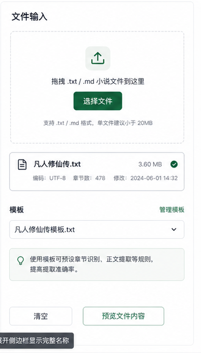
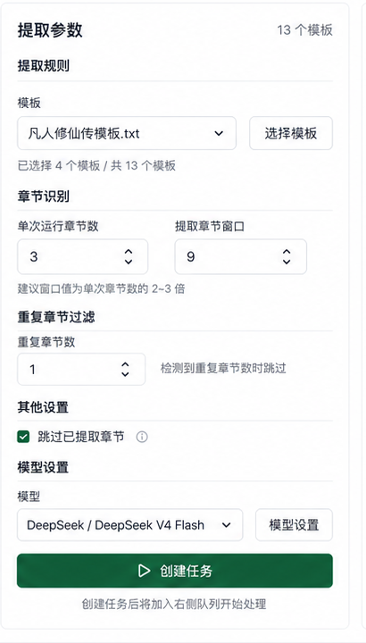
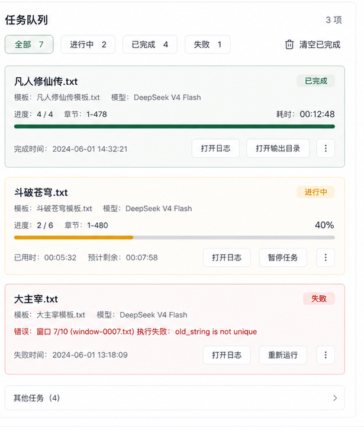
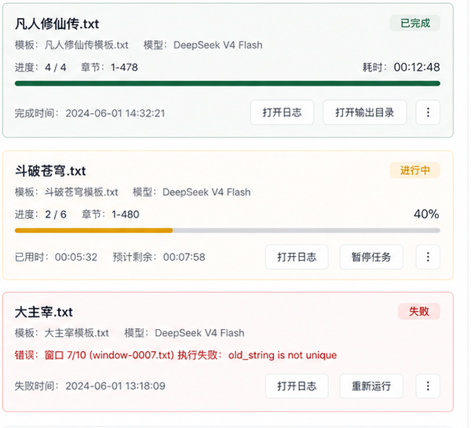

# 小说提取界面重构设计

文档状态：已记录本轮决策，待实施计划拆分

目标：以用户提供的新界面稿为方向，重构桌面端工作台整体体验。重构范围包括工作台外壳、底部状态栏和“小说提取”主体页面，让上传小说、配置提取参数、查看任务队列三个核心动作在同一工作台内更清晰、更可监控，并保留当前已经稳定的任务创建、任务动作、日志查看和模板管理能力。具体阶段拆分后续再讨论，本设计文档先记录总体目标和当前项目风险。

## 参考截图

分区参考图用于后续实施时快速定位，不要求逐像素还原，但要求遵守每个区域的功能意图和信息层级。用户已确认页面标题下方不插入额外概览卡行，后续实施直接进入三栏工作区。

### 外壳导航与窗口栏

确定方向：

- 左侧使用紧凑功能栏承载资产、小说提取、图谱、设置等入口，当前页面要有明确选中态。
- 顶部保留产品名和窗口语义，页面正文上方显示工作台面包屑和当前功能标题。
- 图标化入口必须保留可访问名称，后续如果增加 tooltip 或快捷键，必须以真实可用能力为准。
- 左侧图标导航在鼠标悬停时显示功能名称 tooltip，样式参考截图中的深色浮层；键盘聚焦时也要显示等价名称提示，不能只依赖浏览器默认 `title`。
- 左侧图标导航在鼠标悬停时图标需要有轻微放大动画，建议控制在 `scale(1.08)` 到 `scale(1.12)` 范围内，动效要短促、干净，不引起布局位移，并遵守 `prefers-reduced-motion`。
- 自定义 Electron 窗口标题栏已确认要做，目标是靠近参考图的产品级窗口外壳。
- 允许新增统一图标库，默认按 `lucide-react` 方向规划；实施前仍需检查 `apps/desktop/package.json` 并补依赖。

当前项目差异：

- `WorkbenchNav` 当前由左侧 rail、顶部项目区、功能菜单、语言按钮和用户菜单组成。新稿更接近产品标题栏 + 图标 rail + 页面内容的工作台壳，需要迁移项目名、用户菜单、模型配置和设置入口。
- Electron 主窗口当前使用系统标题栏。改为自定义标题栏时，需要处理无边框窗口、拖拽区、最小化/最大化/关闭按钮、焦点态和 e2e 截图稳定性。
- `apps/desktop/package.json` 当前没有图标库依赖，实施时需要补统一图标库，不能手写一批散落 SVG。

### 页面标题区域

确定方向：

- 页面标题为“小说提取”，副标题解释当前工作流：上传小说文件、配置提取参数、创建任务并开始提取内容。
- 页面标题下方直接进入三栏工作区，不插入额外概览卡行。
- 右侧提供刷新入口时，必须绑定真实刷新行为；如果没有刷新接口，不展示该按钮。

### 文件输入与模板入口

确定方向：

- 左栏负责输入源和模板入口，包含拖拽上传区、已上传文件摘要、模板选择和轻量提示。
- 上传区保留点击选择文件和拖拽上传两种入口。
- 小说源文件已确认支持 `.txt / .md`，其中 `.md` 上传后按纯文本处理并归一化为内部 `.txt` 源文本，不做 Markdown 渲染或结构解释。
- `.md` 上传后界面仍显示用户上传的原文件名，例如 `凡人修仙传.md`，不要因为内部归一化为 `.txt` 而改变用户可见文件名。
- 上传区域不需要占用过大的垂直空间，后续实现应比参考图更紧凑。保留虚线拖拽框，高度约 `120px`，其中只放上传图标、提示文字和“选择文件”按钮。
- 已上传文件摘要显示文件名、大小、编码、章节数等当前已有字段。
- 模板选择保留当前“选择模板”和“管理模板”能力，不删除模板管理、模板上传、手动新增模板功能。
- 模板上传入口保留在当前旧 UI 的位置，不收敛进“管理模板”弹窗。
- 参考图 2 中“模板选择 + 提示 + 清空/预览文件内容”区域不作为最终目标；该区域按当前旧 UI 已有内容逻辑保留和视觉重构，避免丢掉现有模板上传能力。

当前实现对照：

- 上传小说：`apps/desktop/src/renderer/features/extraction/UploadNovelPanel.tsx`
- 模板选择：`apps/desktop/src/renderer/features/templates/TemplateSelector.tsx`
- 模板管理：`apps/desktop/src/renderer/features/templates/TemplateManagementModal.tsx`

实施提醒：

- 当前上传小说只接受 `.txt`。支持 `.md` 是已确认的功能变更，需要同步修改上传校验、源文件保存策略、解析逻辑和测试。
- 内部运行链路继续以 `.txt` 源文本为准，`.md` 只是在上传入口多支持一种来源格式。

### 提取参数面板

确定方向：

- 中栏负责创建任务前的全部参数，按“提取规则、章节识别、重复章节过滤、其他设置、模型设置”分组。
- 数字输入继续绑定当前配置默认值，不在组件中写死默认参数。
- `跳过已提取章节` 继续作为明确的布尔控制。
- 模型选择继续来自 provider 配置派生的 `models`，没有模型时保留前往大模型配置的入口。
- 主按钮为“创建任务”，创建后进入右侧任务队列。

当前实现对照：

- 参数表单：`apps/desktop/src/renderer/features/extraction/ExtractionParameters.tsx`
- 表单状态和 DTO 构建：`apps/desktop/src/renderer/features/extraction/extractionViewModel.ts`
- 参数默认值来源：`packages/config/src/defaults.ts`

设计约束：

- 规则、默认值、状态标签、动作标签继续走配置或视图模型，不允许为了截图效果在 JSX 里写死。
- 分组标题可以是渲染层文案，但具体参数值必须来自配置或当前表单状态。

### 任务队列整体

确定方向：

- 右栏是任务队列，是本次重构最重要的信息区域。
- 顶部提供按状态筛选的 segmented controls，筛选只影响当前列表显示，不改变任务数据。
- 筛选项固定顺序为：`全部`、`进行中`、`暂停`、`失败`、`已完成`。
- 筛选映射：`全部` 显示全部任务，`进行中` 显示 `running`，`暂停` 显示 `paused`，`失败` 显示 `failed`，`已完成` 显示 `completed`。
- `pending` 任务在 `全部` 中展示，卡片自身显示待开始状态，但不作为独立筛选项。
- 任务卡按创建时间倒序，保持当前排序行为。
- 任务卡必须显示状态、进度、失败原因、日志入口和状态允许的操作。
- 状态动作必须继续来自 `getTaskStatusConfig()` 和 `getTaskActionConfig()`，避免在任务卡中写分支硬编码。

当前实现对照：

- 任务列表：`apps/desktop/src/renderer/features/extraction/JobList.tsx`
- 状态和动作配置：`packages/config/src/defaults.ts`
- 任务状态映射：`packages/domain/src/job.ts`

基础实现可落地能力：

- 状态筛选。
- 状态数量徽标。
- 完成、运行、暂停、失败四种视觉强调。
- 现有“展开流程”和“打开完整日志”能力继续保留。
- 不显示“清空已完成”按钮。

### 任务卡状态样式

确定方向：

- 完成任务用绿色弱背景、绿色状态徽标和满进度条。
- 运行中任务用黄色或琥珀色弱背景、进度条和暂停操作。
- 暂停任务需要有独立状态徽标和继续、重新开始、删除等配置允许的操作。
- 失败任务用红色弱背景、失败原因和重试类操作。
- 状态不能只靠颜色表达，必须有文字状态徽标。
- 长错误文本必须 `overflow-wrap: anywhere` 或等价处理，不能撑破卡片。

高级任务卡数据要求：

- 直接做到高级版，不只显示 `progressText` 原文。
- 渲染层不得从中文 `progressText` 中解析百分比、章节区间或窗口编号作为业务字段。
- 需要新增或派生结构化字段，至少覆盖百分比、耗时、预计剩余、完成时间和输出目录。
- `打开输出目录` 默认打开最终报告所在目录，也就是书籍 reports 目录，而不是任务 run 临时目录。
- 预计剩余时间按“已完成窗口平均耗时 × 剩余窗口数”估算；样本不足时显示“计算中”或不显示具体时间，不伪造精确结果。
- 暂停任务显示上一次计算出的预计剩余时间，但明确标为“已暂停”，暂停期间预计剩余不继续跳动。

候选数据契约：

- `progress.completedWindowCount`
- `progress.totalWindowCount`
- `progress.percent`
- `timing.startedAt`
- `timing.completedAt`
- `timing.elapsedMs`
- `timing.estimatedRemainingMs`
- `inputSummary.templateNames`
- `inputSummary.modelDisplayName`
- `outputDirectory`

这些字段如果实施，需要同步更新 IPC 类型、运行时持久化、旧项目兼容读取、主进程更新通知和渲染层视图模型。

### 底部状态栏

确定方向：

- 底部状态栏属于工作台整体重构范围，目标是作为所有工作台页面共享的外壳能力。
- 底部状态栏暂时只保留位置和视觉结构，不显示任何业务内容；后续有真实内容时再补。
- 没有真实数据来源时，不为了贴近截图伪造“API 连接正常”或“并发数”等状态。

## 现有代码边界

本次设计优先沿用当前边界，不引入新的大框架。

- `apps/desktop/src/renderer/features/extraction/ExtractionPage.tsx`：提取页编排，负责三栏布局、页面标题、状态 banner。
- `apps/desktop/src/renderer/features/extraction/UploadNovelPanel.tsx`：小说文件输入和已上传书籍摘要。
- `apps/desktop/src/renderer/features/extraction/ExtractionParameters.tsx`：创建任务参数表单。
- `apps/desktop/src/renderer/features/extraction/JobList.tsx`：任务队列、任务动作、日志入口。
- `apps/desktop/src/renderer/features/extraction/extractionViewModel.ts`：上传书籍、任务、表单状态的视图模型转换。
- `apps/desktop/src/renderer/features/navigation/WorkbenchNav.tsx`：工作台导航外壳。
- `apps/desktop/src/renderer/styles/app.css`：当前主要样式入口。
- `apps/desktop/src/renderer/styles/tokens.css` 和 `apps/desktop/src/renderer/theme.ts`：主题 token 和 CSS 变量。
- `apps/desktop/src/shared/ipcTypes.ts`：主进程和渲染进程任务 DTO 契约。
- `apps/desktop/src/main/projectRuntimeStore.ts`：项目运行态持久化。
- `apps/desktop/src/main/p0Handlers.ts`：任务创建、任务动作、运行状态更新和 DTO 输出。

术语说明：

- 工作台外壳：窗口顶部栏、左侧导航、底部状态栏等包住所有页面的框架区域。修改外壳通常会影响资产页、图谱页、设置弹窗和 e2e 截图。
- 提取页主体：小说提取页内部的标题、上传栏、参数栏、任务队列。

## 当前项目差异与风险

对照当前代码，后续实施需要特别注意以下问题。

1. 工作台外壳不是纯 CSS 改动。`WorkbenchNav` 当前承担项目名、功能菜单、语言按钮、用户菜单和设置入口，新稿需要重新安排这些入口，不能直接删除。
2. 自定义窗口栏会进入 Electron 主进程配置。当前 `BrowserWindow` 使用系统 frame，改为自定义窗口栏时，需要在 `apps/desktop/src/main/main.ts` 和渲染层同时处理窗口按钮、拖拽区域、系统菜单缺失后的操作可达性。
3. 图标化导航需要新增依赖。当前桌面包没有 lucide、phosphor、tabler 等图标库依赖，实施时按统一图标库方案补依赖，不能继续使用文字缩写，也不能手写一批散落 SVG。
4. `.md` 小说上传会牵动后端。`UploadNovelPanel` 当前只接受 `.txt`，`packages/extraction/src/uploadBook.ts` 里 `assertTxtSource` 明确拒绝非 `.txt`，`packages/domain/src/project.ts` 默认源文件路径也是 `original.txt`。支持 `.md` 时需要统一文件类型校验、源文件存储策略、章节解析测试和 IPC 测试。
5. 底部“API 连接正常”和“并发数”当前没有可靠数据来源。本轮不展示这些业务信息。
6. 任务卡截图里的完成时间、耗时、预计剩余、章节范围、输出目录等不是当前 `JobDto` 字段。高级版必须补结构化任务指标，不能从中文 `progressText` 硬解析。
7. 不提供“清空已完成”按钮。已完成任务如需处理，仍按单任务操作或后续另行设计。
8. 当前 CSS 主要集中在 `app.css`，外壳和提取页一起改会影响资产页、图谱页、模板管理弹窗、设置弹窗等共享样式，实施计划需要包含回归检查。

## 推荐改造策略

总体范围已确认包含工作台外壳、底部状态栏和提取页主体。具体如何分阶段实施后续再讨论。下面只按依赖关系拆成能力组，不代表最终排期。

### 能力组 A：工作台结构和基础可用性

目标：贴近截图的信息架构和视觉层级，但只使用当前已经存在的数据字段。

包含：

- 工作台外壳重排，包括窗口顶部区域、左侧导航和跨页面入口。
- 自定义 Electron 窗口标题栏。
- 统一图标库接入和图标化导航。
- 底部状态栏基础布局，但暂不显示业务指标。
- 提取页三栏布局微调。
- 顶部标题区。
- 左栏上传区、文件摘要、模板入口重排。
- `.txt / .md` 小说上传支持，其中 `.md` 归一化为内部 `.txt` 源文本。
- 中栏参数分组视觉增强。
- 右栏任务队列、状态筛选和高级任务卡状态样式。
- 保留现有任务动作、日志展开、打开完整日志、删除确认。
- 响应式规则覆盖 960px 最小窗口和窄屏折叠。

### 能力组 B：结构化任务指标增强

目标：补齐高级任务卡需要的后端数据契约。

包含：

- 扩展 `JobDto`，新增结构化进度、时间、输入摘要和输出目录字段。
- 扩展 `ProjectRuntimeJobRecord`，兼容旧运行态。
- 在任务运行过程中更新结构化 progress，而不是只更新 `progressText`。
- 任务卡使用结构化字段显示百分比、耗时、预计剩余和完成时间。
- 增加打开输出目录 IPC，默认打开最终报告所在目录。

### 后续扩展能力

- API 连接状态。
- 并发数显示。

## 组件设计约束

- 不新增用户没有确认的功能。
- 不删除当前已存在能力，只允许移动入口或调整呈现。
- 可配置项继续走 `@novel-extractor/config` 或项目规则，不写死在 UI 组件里。
- 任务状态标签、动作标签和允许动作继续由配置驱动。
- 渲染层不要解析中文进度字符串来制造百分比或章节区间。
- 图标库按统一方案新增，实施前必须检查 `package.json` 并补依赖；不要手写复杂 SVG 图标。
- 文本按钮、状态徽标、错误消息必须考虑长中文、长英文、路径和模型错误输出。
- 色彩使用现有主题 token 扩展，不在多个组件里分散写十几组近似颜色。

## 响应式和可访问性要求

- 桌面宽屏优先三栏。
- 当前 Electron 最小宽度为 960px，960px 下不能横向溢出或出现不可操作区域。
- 小于约 980px 时可以变为两栏：任务队列独占下一行。
- 小于约 640px 时变为单栏，所有按钮仍可点，长操作区允许横向滚动但不能遮挡正文。
- 状态不只靠颜色，必须有文字标签。
- 所有图标按钮必须有 `aria-label` 或可见文字。
- 筛选控件需要键盘可达，当前筛选状态需要 `aria-pressed` 或等价语义。
- 任务卡操作按钮按配置输出时，要保持可读的按钮名称。

## 测试与验收标准

能力组 A 完成时至少验证：

- 工作台外壳在资产页、小说提取页、图谱页都能正常显示和切换。
- 自定义窗口标题栏的拖拽、最小化、最大化、关闭按钮可用。
- 自定义窗口标题栏的空白区域可拖拽，双击可最大化或还原，右上角最小化、最大化、关闭按钮按 Windows 常规行为工作。
- 图标化导航有可访问名称，当前页面选中态正确。
- 左侧图标导航鼠标悬停和键盘聚焦时都能显示功能名称 tooltip。
- 左侧图标导航鼠标悬停时图标有轻微放大动画，动画不改变导航栏布局，并在减少动画偏好下基本关闭。
- 底部状态栏不会遮挡页面内容，且不显示不可验证的业务指标。
- `ExtractionPage` 能显示标题和三栏区域。
- 页面标题下方不渲染额外概览卡行。
- 状态筛选按 `全部`、`进行中`、`暂停`、`失败`、`已完成` 的顺序出现。
- 任务筛选只改变可见列表，不改变原始任务顺序。
- 运行中任务显示暂停操作，失败任务显示继续、重新开始、删除任务，动作仍调用配置结果。
- 暂停任务能通过 `暂停` 筛选项看到，并继续使用配置允许的动作。
- 长错误原因不会撑破任务卡。
- 不显示“清空已完成”按钮。
- 上传小说接受 `.txt / .md`，`.md` 上传后按内部 `.txt` 源文本进入后续流程，但界面保留原始上传文件名，拒绝其他未支持格式。
- 上传区域尺寸紧凑，不因拖拽区过大挤压模板上传和参数区域。
- 没有模型时仍能进入大模型配置。
- 日志展开、打开完整日志、删除确认行为不回退。
- CSS 或截图检查覆盖 960px、桌面宽屏和窄屏折叠。

能力组 B 完成时至少验证：

- 旧运行态缺少新增字段时仍能打开项目。
- 新建任务会保存并推送结构化进度字段。
- 运行中任务能更新 completed/total/percent。
- 运行中任务能显示已用时间，并按“已完成窗口平均耗时 × 剩余窗口数”显示预计剩余时间；样本不足时不显示伪精确时间。
- 暂停任务显示冻结的上一次预计剩余时间，并标明已暂停。
- 完成任务能显示完成时间。
- 失败任务能显示失败时间或更新时间，但不伪造完成时间。
- 输出目录打开默认指向最终报告所在目录，打开失败时有明确错误反馈。

## 后续扩展问题清单

这些问题不阻塞当前 UI 重构主线，可在后续扩展或实施计划拆分时继续确认。

1. API 连接状态后续是否要做？如果做，判断依据是配置存在、最近一次请求成功，还是增加显式模型连通性测试？
2. 并发数后续是否要显示？如果显示，口径是配置值、当前运行任务数，还是运行队列限制？
3. 图标库使用 `lucide-react`。

## 后续执行入口

下一步创建实施计划。建议实施计划拆为：

1. 小说提取页 UI 结构重构实施计划。
2. 结构化任务指标与输出目录实施计划。
3. 工作台外壳和底部状态栏实施计划。

第一份计划可以先做，不阻塞后两份讨论。
